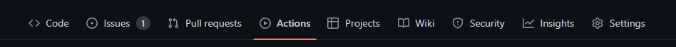
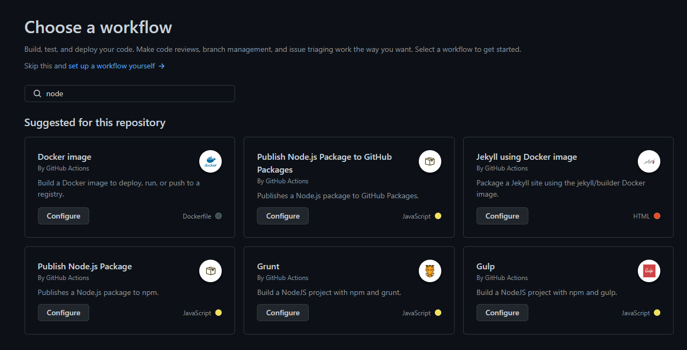
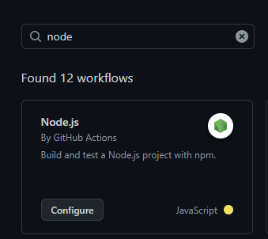

# CI/CD

As part of our IP (Individual Project), we had to design and implement a (semi)automated software release process. There's a couple different ways to do this, but I decided to use Github. Using [Github Actions](https://github.com/features/actions) you can automate a workflow really easily. The workflow will be building, testing and pushing the application to [Dockerhub](https://hub.docker.com/).

## Workflow

To start setting up your workflow, go to [Github](https://github.com/). Select a repository you want to setup the workflow for, and click on the `Actions` tab.



You'll see a page with a list of workflows for different languages and processes. These workflows are premade files with standard instructions based on the language/process to help you get started. There are workflows for:
-   Building and testing your application.
-   Building and deploying your application to platforms like Azure.
-   Building Docker images.
-   Greeting users who are first time contributes.
</br> and more...



Since we'll be creating a workflow for our React application, we'll be needing a `Node.js` workflow. Type `Node` into the searchbar and look for the workflow which builds and tests your application (or a different one depending on your needs). Click on `Configure` and Github will be creating a `yaml` file which will contain some instructions on what to do.



At the top of the file you'll some code specifying during which operation this workflow should run. As you can the default operations are the `push` and `pull_request` operations. That means this workflow will run when someone either pushes to (in this case) the `main` branch, or opens a pull request for the `main` branch. You may change this if you would like the workflow to run for a different branch, or a different operation.

After that come the `jobs`. These are the actual commands that need to be executed. These jobs can be divided into several parts, right now, the first and only one is `build`. It lets you choose the OS you want to use, node versions among other things. The commands you see after `steps` are specific to Node.js and shouldn't need any modifying to work.

```yaml
name: Node.js CI

on:
  push:
    branches: [ "main" ]
  pull_request:
    branches: [ "main" ]

jobs:
  build:

    runs-on: ubuntu-latest

    strategy:
      matrix:
        node-version: [14.x, 16.x, 18.x]
        # See supported Node.js release schedule at https://nodejs.org/en/about/releases/

    steps:
    - uses: actions/checkout@v3
    - name: Use Node.js ${{ matrix.node-version }}
      uses: actions/setup-node@v3
      with:
        node-version: ${{ matrix.node-version }}
        cache: 'npm'
    - run: npm ci
    - run: npm run build --if-present
    - run: npm test
```

## Code Analysis

Into our workflow we'll be integrating static code analysis, using Sonarcloud. Sonarcloud will be analyzing our code and letting us know whether there are security issues, code smells and other problems with our code. For that we'll need to add some extra commands into our workflow file, right under the `npm test` command. 

```yaml
- name: SonarCloud Scan
  uses: SonarSource/sonarcloud-github-action@master
  env:  
    GITHUB_TOKEN: ${{ secrets.GITHUB_TOKEN }}  
    SONAR_TOKEN: ${{ secrets.SONAR_TOKEN }}
```

As you can see, you need to provide a token. That token will grant your workflow access to your Sonarcloud repository. To generate a token go to [Sonarcloud's](https://www.sonarsource.com/products/sonarcloud/) website and login. After doing that go to `My Account` and click on the `Security` tab.


From there you can generate a token. Copy that token, go over to Github and navigate to your repository. Click on the `Settings` tab, under `Security` click on `Secrets` and finally `Actions`. From there you can add the token as a secret, using the key you specified in the yaml-file, in this case `SONAR_TOKEN`. For the `GITHUB_TOKEN` you don't have to do anything, Github handles that part.

Go over to Sonarcloud and complete the setup which Sonarcloud guides you through with a step-by-step form. Import the repository you're setting up the workflow for.

## Dockerhub

As a final step, we'll be building a Docker image and pushing it to our repository on Dockerhub. Before we start adding to our workflow file, go over to [Dockerhub](https://hub.docker.com/) and create an account. After that create a repository.

Add two more secrets to your Github repository, `DOCKER_USERNAME` and `DOCKER_PASSWORD`. I think it should be obvious what these secrets contain.   

`context` is the subdirectory in which my app is placed, it may not be needed if your app is in the root of your repository. Change the tags to the ones needed for your application.

```yaml
dockerhub:
    name: Dockerhub Build and Push
    runs-on: ubuntu-latest
    if: ${{ github.event_name == 'push' }}
    steps:
    
    - uses: actions/checkout@v3
    
    - name: Set up QEMU
        uses: docker/setup-qemu-action@v2
    -
        name: Set up Docker Buildx
        uses: docker/setup-buildx-action@v2
    -
        name: Login to Docker Hub
        uses: docker/login-action@v2
        with:
        username: ${{ secrets.DOCKER_USERNAME }}
        password: ${{ secrets.DOCKER_PASSWORD }}
    -
        name: Build and push
        uses: docker/build-push-action@v3
        with:
        context: ./workethic-fe
        push: true
        tags: tendeza/workethic_s3:fe
```

If everything is setup correctly, your app should be built, tested, analyzed by Sonarcloud and pushed to Dockerhub.